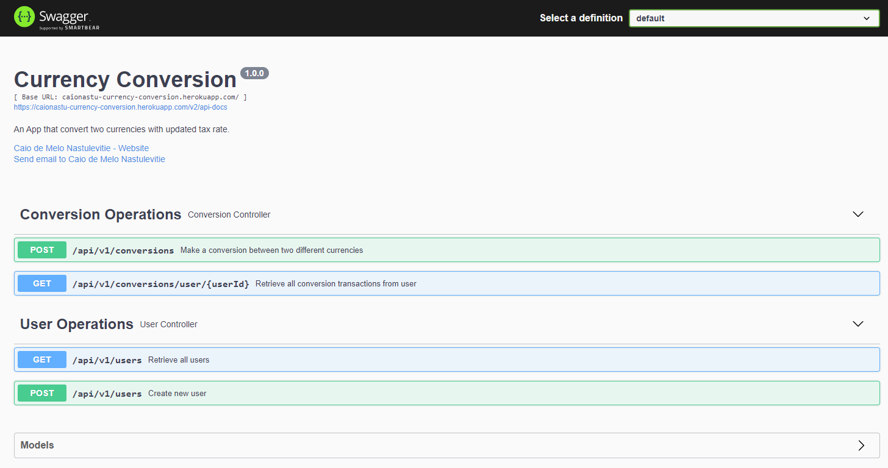
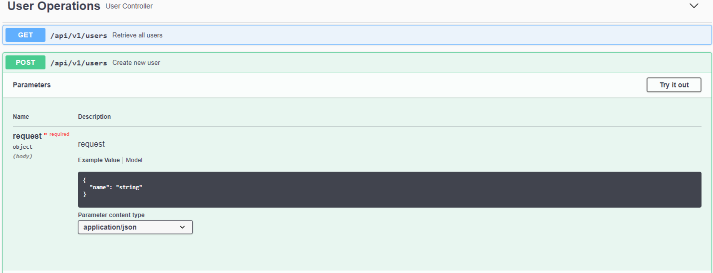
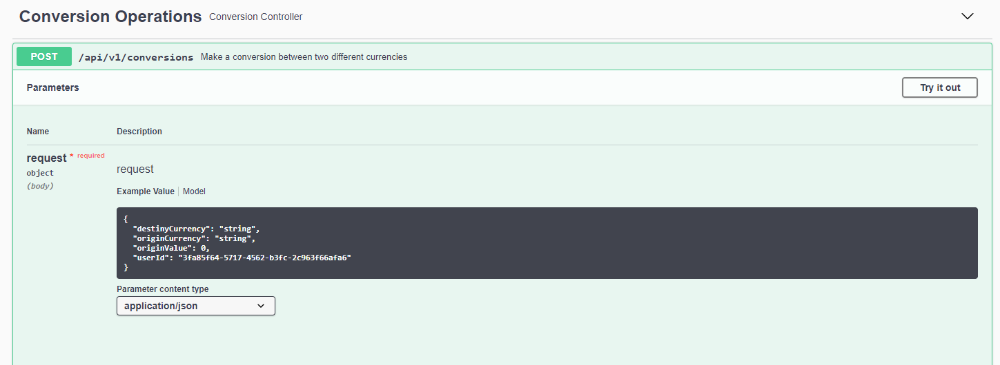
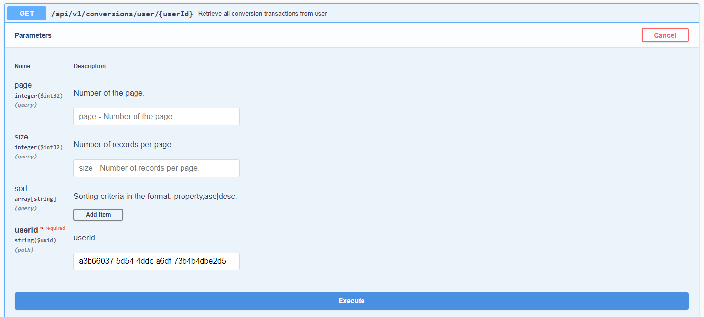

# Currency Conversion API

API that makes a conversion between two different currencies with updated tax rate. The updated tax rate is obtained
from **Exchange API**.

# Exchange API

Exchange API has endpoints for exchange rates like updated rates, conversions, historical rates and so on.

You can check their documentation [here](https://exchangeratesapi.io/documentation/ "Exchange API Documentation").

This project uses only one endpoint from Exchange API, that is the *endpoint for latest rates*. The endpoint only
returns the latest rates with EUR as base currency. So, to make a conversion between two currencies, you have to convert
the origin currency to EUR and then convert EUR to destiny currency, with respective tax rates.

In short, the formula for conversion is:

```
destinyValue = originValue * (destinyTaxRate / originTaxRate)
```

This approach was done because of free plan access from Exchange API, that let you use only EUR as base currency.

## Caching the tax rates
The project uses a free plan from Exchange API and the plan only update the tax rates once
per day. So, if you get five times the tax rates from Exchange API in the same day, the results will always be the same.
So there is no reason to consume Exchange API more than once a day.

With that in mind, the result is cached in memory and has expiration time of 12 hours.
The expiration time is configurable in application properties.

```yaml
exchange:
  api:
    cache:
      expire-time: 10   # in hours. Default is 12h
```

---

# How to run?

You can run this project in different ways:

### Docker

You can pull project's image from [Docker Hub](https://hub.docker.com/r/bolska/currency-conversion).

Or from docker pull command:

```
docker pull bolska/currency-conversion
```

### IDE

You will need:

- Java 11
- Maven
- Your favorite Java IDE

Import the project as **maven project** from your IDE and then, run it.

### Heroku

This project is hosted on Heroku. You can access project API from
this [link](https://caionastu-currency-conversion.herokuapp.com/swagger-ui/ "Link to project API hosted on Heroku").

---

# Using the API

With project running on local, you can access swagger-ui from: <http:localhost:8080/swagger-ui/>




### User

First you will have to create a use from **User Operations** POST method. You will need the user id to make a
conversion.



You can call the GET method to get all users.


### Conversion

After creating a user and having its id, you can make a conversion from **Conversion Operation** POST endpoint.



Body example:

```json
{
  "destinyCurrency": "BRL",
  "originCurrency": "USD",
  "originValue": 15,
  "userId": "3fa85f64-5717-4562-b3fc-2c963f66afa6"
}
```

If is a successful conversion, you will get this Response:

```json
{
  "id": "489dc979-beb2-45e9-aa57-89b9c9868872",
  "userId": "a3b66037-5d54-4ddc-a6df-73b4b4dbe2d5",
  "originCurrency": "USD",
  "originValue": 15,
  "destinyCurrency": "BRL",
  "destinyValue": 76.35225,
  "taxRate": 5.09015,
  "date": "2021-06-20T23:32:21.890072Z"
}
```

You can get all conversion transactions by user with **Conversion Operation** GET endpoint.



Response:

```json
{
  "hasNext": false,
  "pageSize": 20,
  "pageNumber": 0,
  "totalElements": 1,
  "items": [
    {
      "id": "489dc979-beb2-45e9-aa57-89b9c9868872",
      "userId": "a3b66037-5d54-4ddc-a6df-73b4b4dbe2d5",
      "originCurrency": "USD",
      "originValue": 15,
      "destinyCurrency": "BRL",
      "destinyValue": 76.35225,
      "taxRate": 5.09015,
      "date": "2021-06-20T23:32:21.890072Z"
    }
  ]
}
```

---

# Technical Notes

## Stack

This project uses the following stack:

- Java 11
- Spring 2.5.1
- Maven

Some Dependencies used:

- H2 for embedded database
- Open Feign Client for external API calls
- Flyway for database migration
- Swagger (SpringFox) for API documentation
- AssertJ for making test assertions


## Plugins

This project uses JIB maven plugin from Google to generate a docker image and push to Docker HUb.

Documentation [here](https://github.com/GoogleContainerTools/jib/tree/master/jib-maven-plugin).

The command to use the plugin is:

```
mvn compile jib:build
```

## Currencies

This project supports 168 currencies.

```
AED, AFN, ALL, AMD, ANG, AOA, ARS, AUD, AWG, AZN, BAM, BBD, BDT, BGN, BHD, BIF, BMD, BND, BOB, BRL, BSD, BTC, BTN, BWP, BYN, BYR, BZD, CAD, CDF, CHF, CLF, CLP, CNY, COP, CRC, CUC, CUP, CVE, CZK, DJF, DKK, DOP, DZD, EGP, ERN, ETB, EUR, FJD, FKP, GBP, GEL, GGP, GHS, GIP, GMD, GNF, GTQ, GYD, HKD, HNL, HRK, HTG, HUF, IDR, ILS, IMP, INR, IQD, IRR, ISK, JEP, JMD, JOD, JPY, KES, KGS, KHR, KMF, KPW, KRW, KWD, KYD, KZT, LAK, LBP, LKR, LRD, LSL, LTL, LVL, LYD, MAD, MDL, MGA, MKD, MMK, MNT, MOP, MRO, MUR, MVR, MWK, MXN, MYR, MZN, NAD, NGN, NIO, NOK, NPR, NZD, OMR, PAB, PEN, PGK, PHP, PKR, PLN, PYG, QAR, RON, RSD, RUB, RWF, SAR, SBD, SCR, SDG, SEK, SGD, SHP, SLL, SOS, SRD, STD, SVC, SYP, SZL, THB, TJS, TMT, TND, TOP, TRY, TTD, TWD, TZS, UAH, UGX, USD, UYU, UZS, VEF, VND, VUV, WST, XAF, XAG, XAU, XCD, XDR, XOF, XPF, YER, ZAR, ZMK, ZMW, ZWL
```

All currencies were obtained from Exchange API.

The project stores all currencies in a database table. So, if you want to add new currency,
you just insert a new row on Currency table, and the project will automatically support the new currency.
This doesn't mean that will successfully get the tax rate for the new currency. The Exchange API must support the new currency too.

# Problem with Pageable and Swagger

There is a known [issue](https://github.com/springfox/springfox/issues/2623)
with Swagger trying to deserialize Pageable entity.

The workaround was creating one annotation that configure the pagination attributes in Swagger and use in conjunction
with @ApiIgnore annotation to ignore the Pageable attributes.

ApiPageable interface:

```java
@Target({ElementType.METHOD, ElementType.ANNOTATION_TYPE, ElementType.TYPE})
@Retention(RetentionPolicy.RUNTIME)
@ApiImplicitParams({
        @ApiImplicitParam(name = "page", dataTypeClass = Integer.class, paramType = "query", value = "Number of the page."),
        @ApiImplicitParam(name = "size", dataTypeClass = Integer.class, paramType = "query", value = "Number of records per page."),
        @ApiImplicitParam(name = "sort", allowMultiple = true, dataTypeClass = String.class, paramType = "query", value = "Sorting criteria in the format: property,asc|desc.")
})
public @interface ApiPageable {
}
```

Usage:

```java
@RestController
public class ExampleController {
    @ApiPageable
    @GetMapping
    public ResponseEntity<Void> usageExample(@ApiIgnore Pageable pageable){
        return ResponseEntity.noContent().build();
    }
}
```